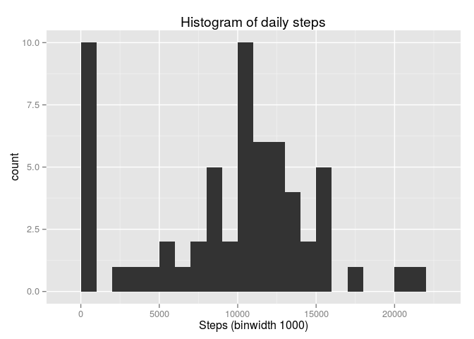
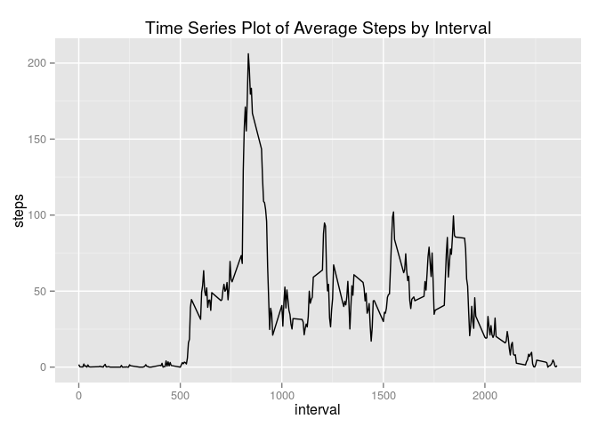
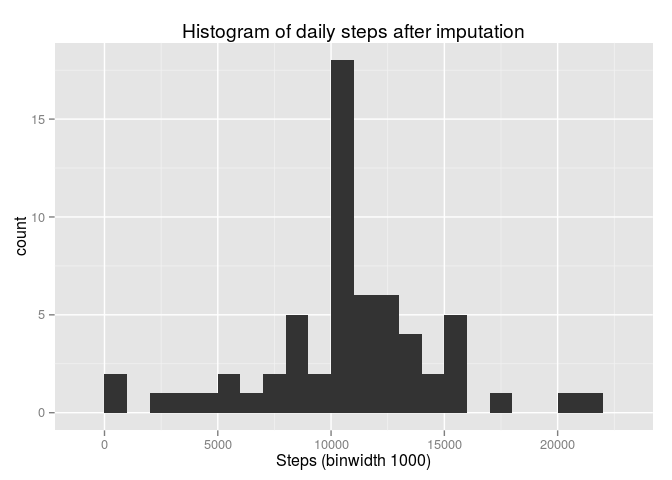
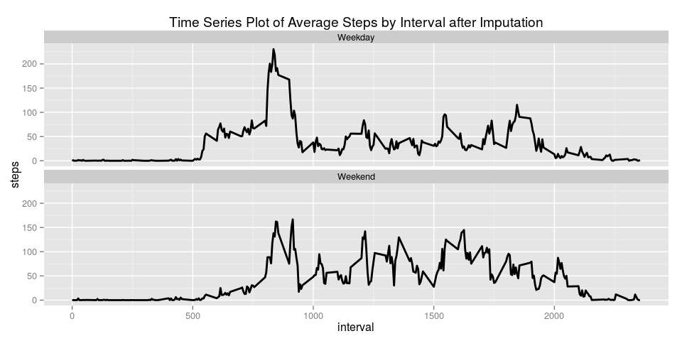

# Reproducible Research: Peer Assessment 1
Clear the R enviroment of previous variables. 

```r
## Removes all variables from environment
rm(list=ls(all=TRUE)) 
```

The data is downloaded as indicated on the assigment page and loaded into R. 

```r
#Load the data
dat <- read.csv('activity.csv', header = T)
```
Summary of the data is obtained and inspected using the R functions names, str, and head:

```r
names(dat)
```

```
## [1] "steps"    "date"     "interval"
```

```r
str(dat)
```

```
## 'data.frame':	17568 obs. of  3 variables:
##  $ steps   : int  NA NA NA NA NA NA NA NA NA NA ...
##  $ date    : Factor w/ 61 levels "2012-10-01","2012-10-02",..: 1 1 1 1 1 1 1 1 1 1 ...
##  $ interval: int  0 5 10 15 20 25 30 35 40 45 ...
```

```r
head(dat)
```

```
##   steps       date interval
## 1    NA 2012-10-01        0
## 2    NA 2012-10-01        5
## 3    NA 2012-10-01       10
## 4    NA 2012-10-01       15
## 5    NA 2012-10-01       20
## 6    NA 2012-10-01       25
```

The following variables are included in this dataset:

- **steps**: Number of steps taking in a 5-minute interval (missing values are coded as NA ) 
- **date**: The date on which the measurement was taken in YYYY-MM-DD format 
- **interval**: Identifier for the 5-minute interval in which measurement was taken


```r
#Transform the data into a more suitable format for the analysis
dat$date <- as.Date((dat$date))
```


## What is mean total number of steps taken per day?


```r
#histogram of the total number of steps taken each day
library(ggplot2)
totalstepsbyday <- aggregate(x = dat$steps , by = list(dat$date), FUN = sum ,na.rm=TRUE)
names(totalstepsbyday) <- c("date","steps")
histplot <- ggplot(totalstepsbyday,aes(x = steps)) +
            ggtitle("Histogram of daily steps") +
            xlab("Steps (binwidth 1000)") +
            geom_histogram(binwidth = 1000)
histplot
```

 

```r
#mean total number of steps taken per day
mean(totalstepsbyday$steps , na.rm = TRUE)
```

```
## [1] 9354.23
```

```r
#median total number of steps taken per day
median(totalstepsbyday$steps , na.rm = TRUE)
```

```
## [1] 10395
```

## What is the average daily activity pattern?
1. A time series plot (i.e. type = "l") of the 5-minute interval (x-axis) and the average number of steps taken, averaged across all days (y-axis).

```r
#Time series plot of 5-minute interval and the average number of steps taken, averaged across all days
averagestepsbyinterval  <- aggregate(x = dat$steps , by = list(dat$interval), FUN = mean ,na.rm=TRUE)
names(averagestepsbyinterval) <- c("interval","steps")

avgstepline <- ggplot(averagestepsbyinterval,aes(interval,steps)) +
                 ggtitle("Time Series Plot of Average Steps by Interval") +
                 geom_line()
avgstepline  
```

 

2. The interval which contains the maximum number of steps is 835.


```r
#The 5-min time interval contains the maximum number of steps?
averagestepsbyinterval[which.max(averagestepsbyinterval$steps),c("interval")]
```

```
## [1] 835
```

## Imputing missing values

Find missing values:


```r
#total number of missing values in the dataset
nrow(dat[is.na(dat$steps),])
```

```
## [1] 2304
```
There are 394 missing values which have to be filled with the mean value in order to keep the data similar.


```r
#imputing missing step values with mean step at time interval
dat.imputed <- merge(x = dat, y = averagestepsbyinterval, by = "interval", all.x = TRUE)
dat.imputed[is.na(dat.imputed$steps.x),c("steps.x")] <- dat.imputed[is.na(dat.imputed$steps.x),c("steps.y")]

#cleaning data
dat.imputed$date <- as.Date(dat.imputed$date)
dat.imputed$date.x <- NULL
dat.imputed$Group.1 <- NULL
dat.imputed$steps <- dat.imputed$steps.x
dat.imputed$steps.x <- NULL
dat.imputed$steps.y <- NULL
```

Histogram of the new data set:


```r
#histogram with new dataframe
totalstepsbyday <- aggregate(x = dat.imputed$steps , by = list(dat.imputed$date), FUN = sum ,na.rm=TRUE)
names(totalstepsbyday) <- c("date","steps")
histplot <- ggplot(totalstepsbyday,aes(x = steps)) +
            ggtitle("Histogram of daily steps after imputation") +
            xlab("Steps (binwidth 1000)") +
            geom_histogram(binwidth = 1000)
histplot 
```

 

```r
#mean total number of steps taken per day
mean(totalstepsbyday$steps , na.rm = TRUE)
```

```
## [1] 10766.19
```

```r
#median total number of steps taken per day
median(totalstepsbyday$steps , na.rm = TRUE)
```

```
## [1] 10766.19
```


## Are there differences in activity patterns between weekdays and weekends?

1. Create a new factor variable in the dataset with two levels – “weekday” and “weekend” indicating whether a given date is a weekday or weekend day. 


```r
#Factor variable with two levels indicating a weekday or weekend.
# The days in the next line depend on your local system settings. 
# If your local setting is se to US or UK you should use c("Saturday","Sunday"), otherwise you should put the one corresponding to your own country. 
# The below functions work for country set to Romaania
dat.imputed$weekday <- as.factor(ifelse(weekdays(dat.imputed$date) %in% c("sâmbătă","duminică"), "Weekend", "Weekday")) 

averagestepsbyintervalandweekday  <- aggregate(x = dat.imputed$steps , 
                                                    by = list(dat.imputed$interval,dat.imputed$weekday), FUN = mean ,na.rm=TRUE)
names(averagestepsbyintervalandweekday) <- c("interval","weekday","steps")

#panel time series plot of the 5-minute interval and the average number of steps taken 
#averaged across all weekday days or weekend days.
avgstepline <- ggplot(averagestepsbyintervalandweekday,aes(interval,steps)) +
               ggtitle("Time Series Plot of Average Steps by Interval after Imputation") + 
               facet_wrap( ~weekday,ncol=1) + geom_line(size = 1)
avgstepline  
```

 

